---
## Front matter
title: "Лабораторная работа №1"
subtitle: "Кибербезопасность предприятия"
author: |
    | Аскеров Александр Эдуардович 
    | Замбалова Дина Владимировна
    | Кузнецова София Вадимовна
    | Поляков Глеб Сергеевич
    | Скандарова Полина Юрьевна
    | Тарутина Кристина Еленовна
    | Цвелев Сергей Андреевич
    | Шулуужук Айраана Вячеславовна
    | Учебная группа: НПИбд-01-22

## Generic otions
lang: ru-RU
toc-title: "Содержание"

## Bibliography
bibliography: bib/cite.bib
csl: pandoc/csl/gost-r-7-0-5-2008-numeric.csl

## Pdf output format
toc: true # Table of contents
toc-depth: 2
lof: true # List of figures
fontsize: 12pt
linestretch: 1.5
papersize: a4
documentclass: scrreprt
## I18n polyglossia
polyglossia-lang:
  name: russian
  options:
	- spelling=modern
	- babelshorthands=true
polyglossia-otherlangs:
  name: english
## I18n babel
babel-lang: russian
babel-otherlangs: english
## Fonts
mainfont: PT Serif
romanfont: PT Serif
sansfont: PT Sans
monofont: PT Mono
mainfontoptions: Ligatures=TeX
romanfontoptions: Ligatures=TeX
sansfontoptions: Ligatures=TeX,Scale=MatchLowercase
monofontoptions: Scale=MatchLowercase,Scale=0.9
## Biblatex
biblatex: true
biblio-style: "gost-numeric"
biblatexoptions:
  - parentracker=true
  - backend=biber
  - hyperref=auto
  - language=auto
  - autolang=other*
  - citestyle=gost-numeric
## Pandoc-crossref LaTeX customization
figureTitle: "Рис."
tableTitle: "Таблица"
listingTitle: "Листинг"
lofTitle: "Список иллюстраций"
lolTitle: "Листинги"
## Misc options
indent: true
header-includes:
  - \usepackage{indentfirst}
  - \usepackage{float} # keep figures where there are in the text
  - \floatplacement{figure}{H} # keep figures where there are in the text
---

# Цель работы

Целью лабораторной работы является исследование сценария целенаправленной атаки на корпоративный мессенджер и сопутствующие сервисы, выявить и продемонстрировать эксплуатацию реальных уязвимостей (WpDiscuz, ProxyLogon, RocketChat), а также отработать методы обнаружения, локализации и нейтрализации последствий компрометации для восстановления безопасности информационной инфраструктуры организации.

# Теоретическое введение

## Легенда. Защита корпоративного мессенджера

Конкуренты решили скомпрометировать деятельность Компании и
нашли для этого исполнителя. Злоумышленник находит в Интернете сайт
соответствующего предприятия и решает провести атаку на него с целью
получения доступа к внутренним ресурсам.
Проэксплуатировав обнаруженную на сайте уязвимость, нарушитель
стремится захватить управление другими ресурсами защищаемой сети, в том
числе, пытается закрепиться на почтовом сервере и продолжить атаку.
Главная задача злоумышленника - получение доступа к переписке
сотрудников компании, раскрытие учётных данных пользователей,
зарегистрированных в приложении корпоративного мессенджера, с целью
использования их для нанесения ущерба репутации конкурирующей
Компании.
Квалификация нарушителя высокая. Он умеет использовать
инструментарий для проведения атак, а также знает техники
постэксплуатации.

## Описание уязвимостей

### WpDiscuz

CVE-2020-24186 – это уязвимость в плагине
для создания комментариев WpDiscuz версии
с 7.0.0 по 7.0.4 включительно. Уязвимость
позволяет получить RCE (удаленное
выполнение кода).

### Proxylogon

Proxylogon представляет собой SSRFуязвимость, позволяющую обойти
аутентификацию и выдать себя за
администратора.

Следующий шаг после SSRF – эксплуатация CVE 2020-27065. Данная
уязвимость является следствием неэффективного ограничения выбора
расположения backup виртуальной директории автономных адресных книг.

### RocketChat

CVE-2021-22911 представляет собой
сочетание из двух SQL-инъекций: 
- слепая NoSQL-инъекция,
- NoSQL-инъекция №2: повышение
привилегий.

CVE-2022-0847 (Dirty Pipe) представляет
собой уязвимость повышения привилегий,
находящаяся в самом ядре Linux версии 5.8
и выше.

# Выполнение лабораторной работы

Подключили vpn WireGuard, чтобы открыть сайт Ampire с лабораторной работой (рис. [-@fig:001]).

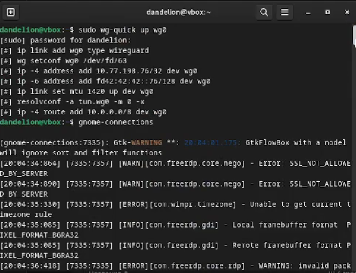{#fig:001 width=70%}

Рассмотрим вектор атаки (рис. [-@fig:002]).

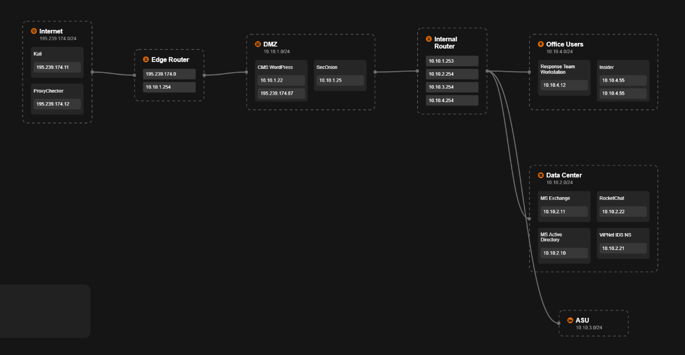{#fig:002 width=70%}

## Уязвимый узел WpDiscuz

### Обнаружение уязвимости

Среди множества плагинов в CMS WordPress можно выделить
WpDiscuz – один из плагинов для создания комментариев. WpDiscuz
представляет собой систему для комментариев на базе Ajax, которая хранит
сообщения в локальной базе данных. В версиях с 7.0.0 по 7.0.4
включительно существует уязвимость File Upload, которая позволяет
получить RCE, если прикрепить любой файл (например, код на PHP) в поле для
комментариев и загрузить на сервер. Данный процесс можно выполнить без
аутентификации.
Уязвимость позволяет получить удаленное выполнение кода при
загрузке неавторизированным пользователем определенного файла с
расширением PHP, достаточно прикрепить файл с PHP-кодом в поле для ввода
комментариев [@wpdiscuz].

После создания файла с полезной нагрузкой нарушитель будет
производить POST-запрос с определенными параметрами по ссылке
http://webportal3.ampire.corp/index.php/wp-admin/admin-ajax.php
для загрузки файла. Факт загрузки будет детектироваться в журнале
активности в WordPress, в котором записывается хронологическая запись
последовательности изменений и действий.
В первую очередь необходимо войти в панель администратора, для чего
в адресной строке браузера http://IP-адрес дописать один из вариантов:
- /wp-admin – на вход в панель управления;
- /wp-login.php – вход на страницу регистрации

С помощью WP Activity Log можно проверить журнал и обнаружить
время, дату, роль и IP-адрес пользователя, который внес изменения. По
информации из журналов на сервере можно отыскать причину взлома и
устранить возникшие уязвимости. Далее перейти в Activity Log, обнаружить авторизацию внешнего
пользователя и загрузку файла.
Из файла журнала сервера apache2, который находится по пути
/var/log/apache2/access.log, можно отметить подозрительную
активность, заключающуюся в множественных запросах к страницам
авторизации, административному файлу admin-ajax.php, а также запросу на
чтение файла readme.txt. В User-Agent присутствует pythonrequests/2.28.1, что может свидетельствовать об использовании скрипта на
Python для выполнения запросов.

Детектирование эксплуатации уязвимости удаленного выполнения кода
CVE-2020-24186 проводится с помощью сетевого сенсора ViPNet IDS NS.

### Обнаружение и нейтрализация полезных нагрузок.

Для начала скачали приложение Remmina, чтобы подключиться к удаленному рабочему столу. Запустили его, ввели указанный на сайте Ampire ip-адрес 10.140.2.180, ввели логин и пароль (рис. [-@fig:003]).

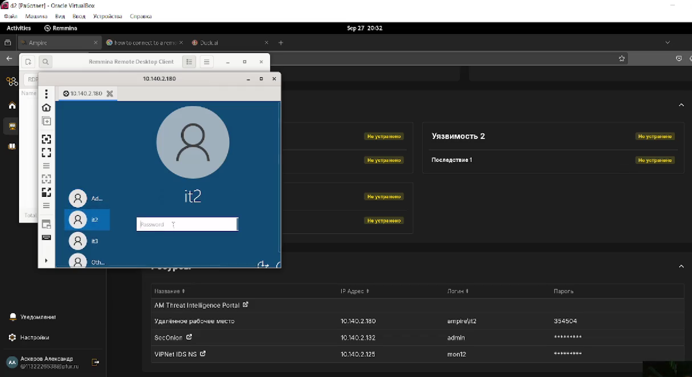{#fig:003 width=70%}

В файле KeyPass password посмотрели пароль для KeyPass 2 (рис. [-@fig:004]).

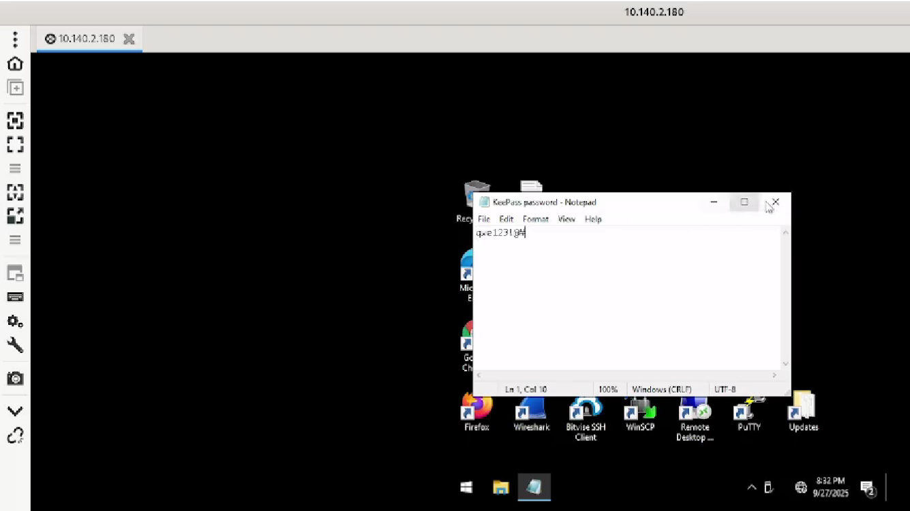{#fig:004 width=70%}

Заходим в KeyPass 2, вводим пароль (рис. [-@fig:005]).

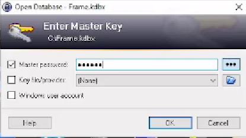{#fig:005 width=70%}

Так как у нас атакован сервер CMS WordPress, мы переходим в папку DMZ, затем в CMS WordPress (рис. [-@fig:006]).

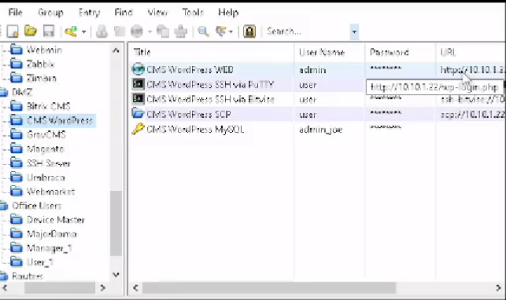{#fig:006 width=70%}

Посмотрим на атакованный сайт 10.10.1.22 (http://webportal3.ampire.corp) (рис. [-@fig:007]).

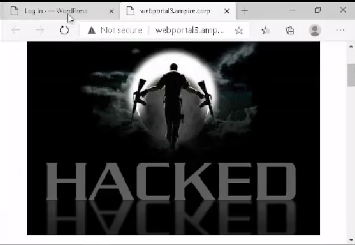{#fig:007 width=70%}

Deface сайта. Данная полезная нагрузка подразумевает изменение интерфейса главной страницы сайта.

Чтобы войти в панель администратора, зайдем на страницу регистрации http://10.10.1.22/wp-login.php. Логин и пароль берем из KeyPass 2 (рис. [-@fig:008]).

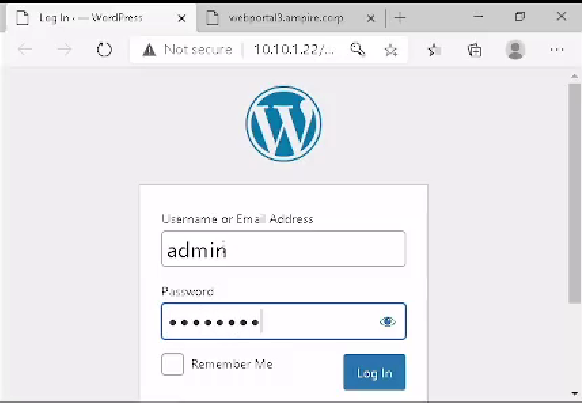{#fig:008 width=70%}

Deface сайта. Данная полезная нагрузка подразумевает изменение интерфейса главной страницы сайта.

Закрытие полезной нагрузки: на веб-сервере работает FTP-сервер
vsftpd, который дает возможность плагину i сохранять и скачивать
резервную копию. Таким образом, можно выполнить восстановление из
последнего файла резервной копии.

Для нейтрализации данной полезной нагрузки необходимо
сформировать резервную копию с помощью плагина Updraft
Backup/Restore.
Этапы восстановления:
- в панели управления на странице Plugins найти плагин
резервного восстановления UpdraftPlus, открыть настройки (рис. [-@fig:009])

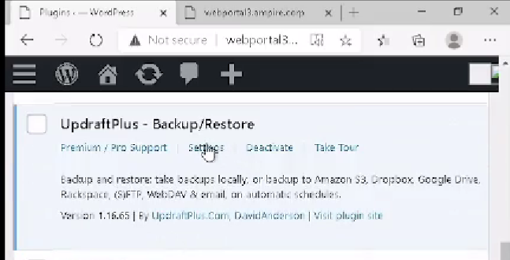{#fig:009 width=70%}

- для восстановления нажать Restore на последней резервной
копии (рис. [-@fig:010])

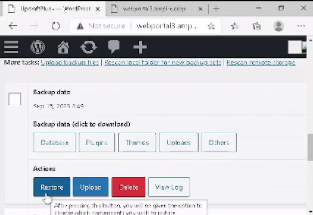{#fig:010 width=70%}

- далее в выпадающем окне выбора компонентов для
восстановления выбрать только Themes и Uploads (рис. [-@fig:011])

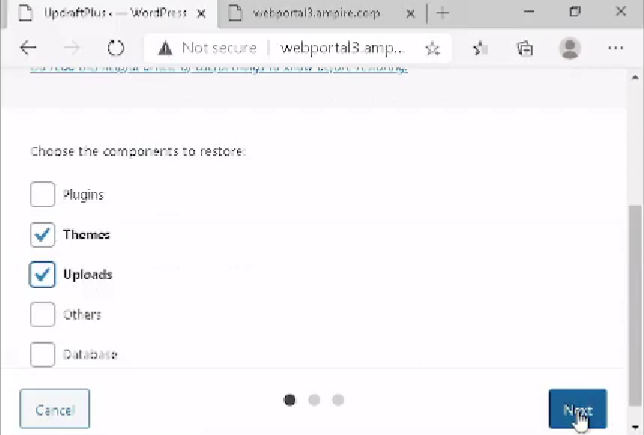{#fig:011 width=70%}

- далее нажать Next и Restore;
- при возникновения ошибки необходимо в журнале действий
нажать на опцию Delete Old Directories (рис. [-@fig:012])

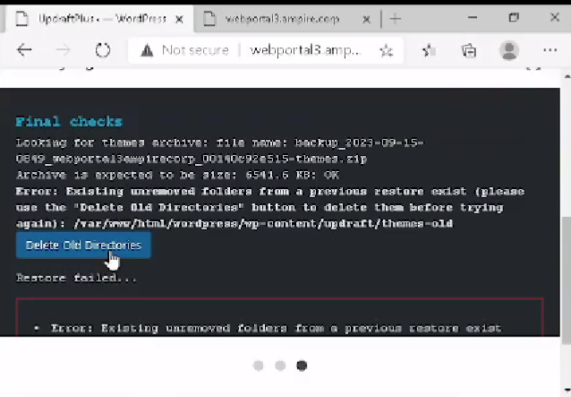{#fig:012 width=70%}

- осуществить возврат к конфигурации, активировать опцию Return
to configuration (рис. [-@fig:013])

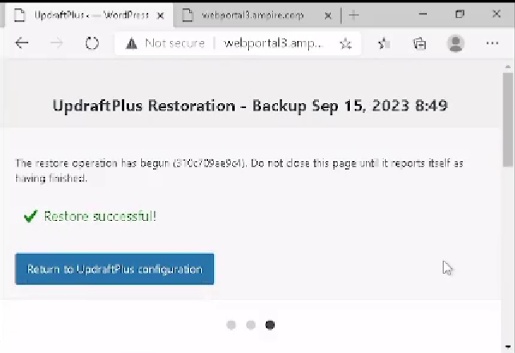{#fig:013 width=70%}

После обновления страницы откроется первоначальная картинка сайта (рис. [-@fig:014]) 

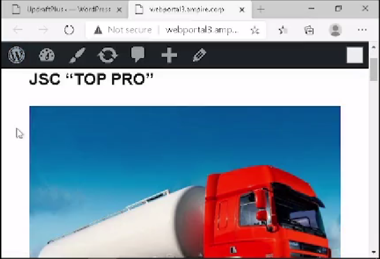{#fig:014 width=70%}

Последствие успешно устранено.

Meterpreter-сессия. Данная полезная нагрузка заключается в том, что нарушитель
устанавливает shell-сессию с уязвимой машиной.
Для обнаружения meterpreter-сессии необходимо проверить сокеты
уязвимой машины на подключение к определенному порту машины
нарушителя с помощью утилиты ss. Просмотреть сокеты только нужного
протокола TCP и отфильтровать данные (например, вывести только активные
TCP-соединения) можно с помощью команды:
ss -tnp

Для закрытия вредоносного сокета необходимо завершить процесс,
использующийся для поддержания соединения. При завершении процесса
определить уникальный идентификатор процесса (PID) и прописать команду
kill с соответствующими параметрами (рис. [-@fig:015]).

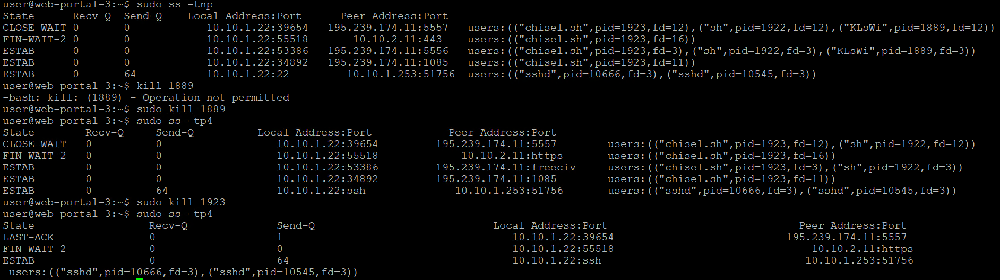{#fig:015 width=70%}

Уязвимость и последствия WpDiscuz устранены (рис. [-@fig:016]).

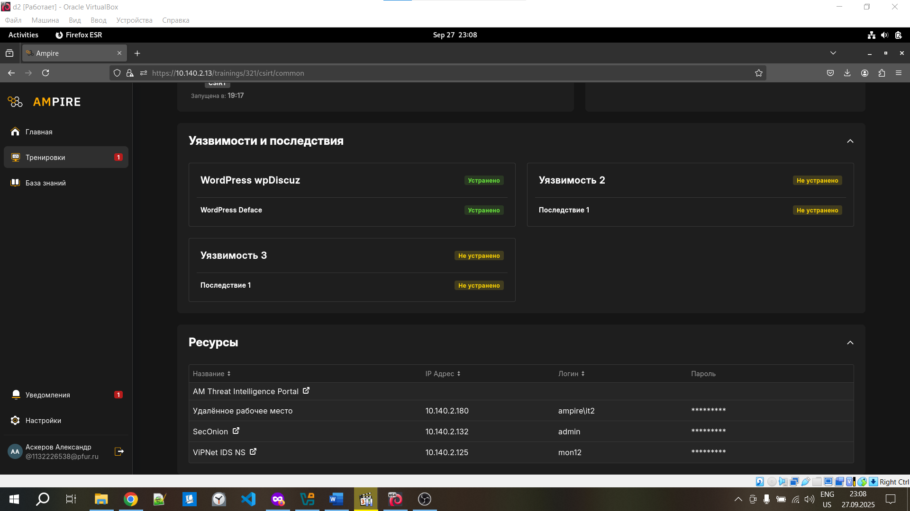{#fig:016 width=70%}

##  Уязвимый узел Proxylogon

Подделка запроса на стороне сервера – это атака, которая позволяет
отправлять запросы от имени сервера к внешним или внутренним ресурсам.
Нарушитель может контролировать весь запрос целиком или отдельные части
запроса (например, домен).
Для эксплуатации уязвимости SSRF должно быть выполнено три
условия:
- нарушитель должен знать один работающий e-mail;
- раздел cookie «X-BEResource» должен содержать FQDN
атакуемого сервера + /autodiscover/autodiscover.xml?a=~1. Значение
cookie обязательно должно заканчиваться на цифру;
- тело запроса содержит специально сформированный XML SOAP [@proxylogon].

### Обнаружение CVE 2021-26855 (SSRF) средствами ОС

Снова подключились к удаленному рабочему столу с ip-адресом 10.140.2.153 (рис. [-@fig:017]).

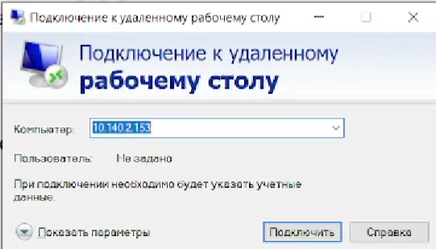{#fig:017 width=70%}

Внутри него подключились к удаленному рабочему столу с ip-адресом атакованного сервера 10.10.2.11 (рис. [-@fig:018]).

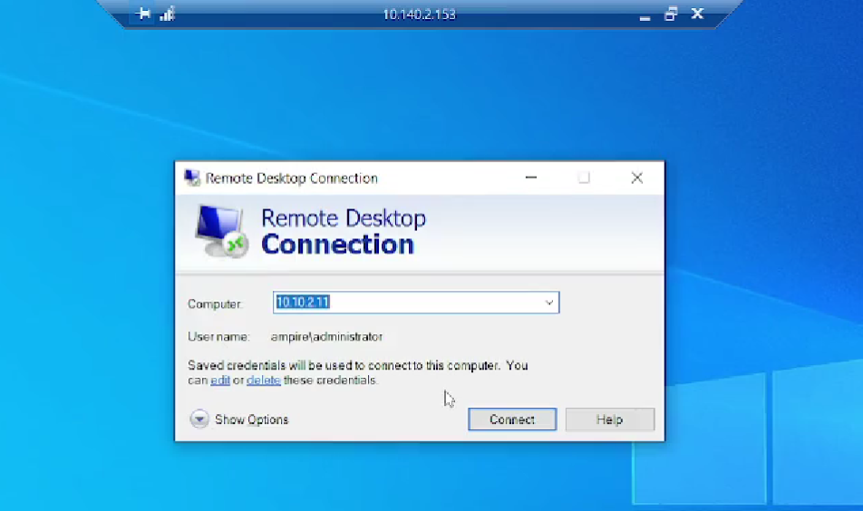{#fig:018 width=70%}

Все запросы, подробно представленные в соответствующем описании, могут быть обнаружены в логах IIS. Логи расположены в
директории C:/inetpub/logs/LogFiles. В логах необходимо перейти в
папку атакуемого сервера (W3SVC1) и в данной папке просмотреть новый файл.
Примеры возможных логов атаки изображены на скриншотах (рис. [-@fig:019]-[-@fig:020]).

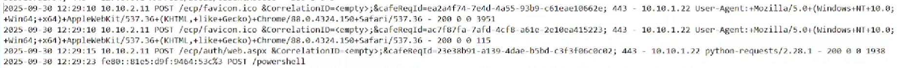{#fig:019 width=70%}

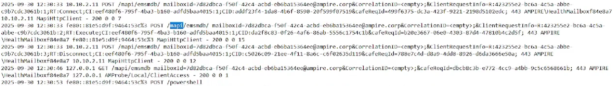{#fig:020 width=70%}

В скрипте обнаружены запросы, где нарушитель получает SID искомого
пользователя с помощью HTTP-запроса к MAPI. Нарушитель
отправляет запрос для делегирования доступа к почтовому ящику. Данный
запрос также перенаправляется к MAPI от имени пользователя машинного
аккаунта и вызывает ошибку доступа. Ошибка содержит SID искомого
пользователя, после получения которого нарушитель сможет
аутентифицироваться на сервере. Нарушитель выдает себя за администратора,
отправляет на /ecp/proxyLogon.ecp POST запрос, сформированный
специальным образом.

### Обнаружение CVE 2021-26855 (SSRF) средствами ViPNet IDS NS

С удаленного рабочего стола авторизуемся в ViPNet IDS
NS. В фильтре укажем дату и время запуска лабораторной работы (рис. [-@fig:021]).

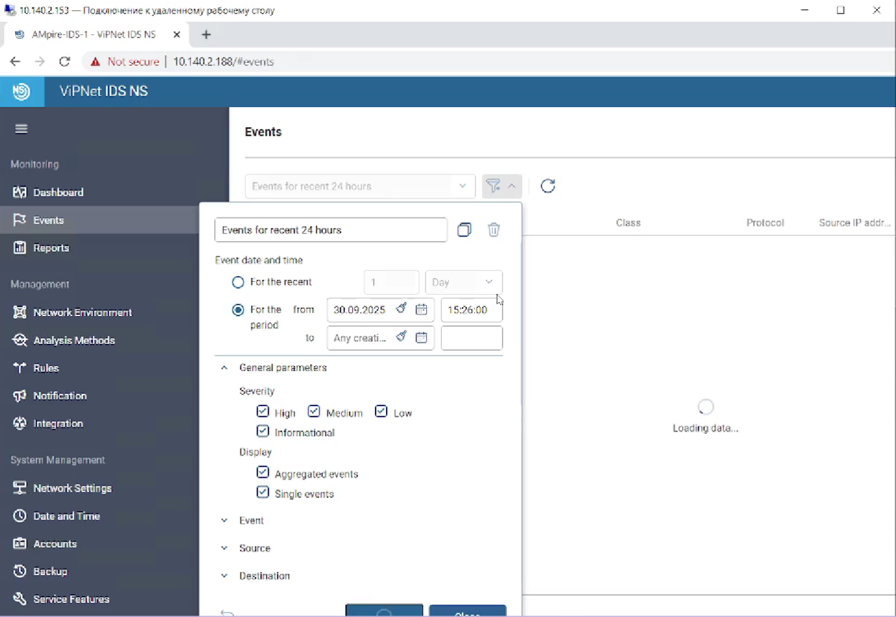{#fig:021 width=70%}

Proxylogon представляет собой SSRF в Exchange Server, позволяющую
обойти аутентификацию и выдать себя за администратора. В сценарии данная
уязвимость используется в связке с CVE 2021-27065 (запись файла в
произвольную директорию). Уязвимости Proxylogon подвержены все
Exchange Server 2016, до версии 15.01.2106.013.
Сетевой сенсор ViPNet IDS NS во время атаки детектирует несколько
событий, которые потенциально могут быть связаны с эксплуатацией
уязвимости на уязвимом хосте (рис. [-@fig:022]).

{#fig:022 width=70%}

В списке событий присутствуют признаки загрузки на уязвимый хост
подозрительных файлов в формате .exe, событие № 1.
Также зафиксирована активность вредоносного программного
обеспечения Metasploit, событие № 2.

### Устранение уязвимостей

Во время эксплуатации уязвимости Proxylogon нарушитель совершает
GET и POST запросы к /ecp. Достаточно ограничить доступ к указанной
директории для запрета эксплуатации уязвимости.
1. Для открытия Internet Information Services (IIS) Manager
необходимо нажать сочетание клавиш Win + R и в появившемся окне
ввести inetmgr и нажать Enter.
2. В открывшемся окне перейти во вкладку MAIL/Sites/Default Web
Site/ecp и нажать на IP Address and Domain Restrictions (рис. [-@fig:023]).

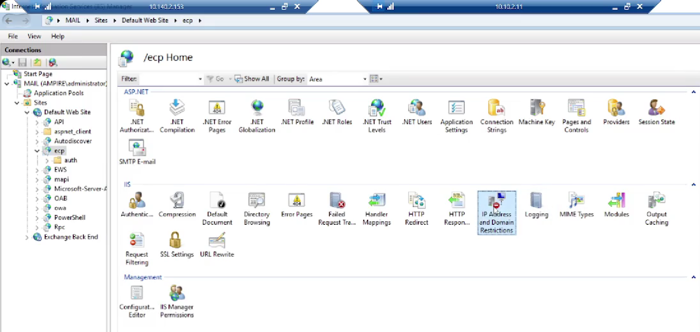{#fig:023 width=70%}

3. Далее в «Edit Feature Settings» – «Access for unspecified clients»
выбрать пункт «Deny» и нажать «OK» (рис. [-@fig:024]).

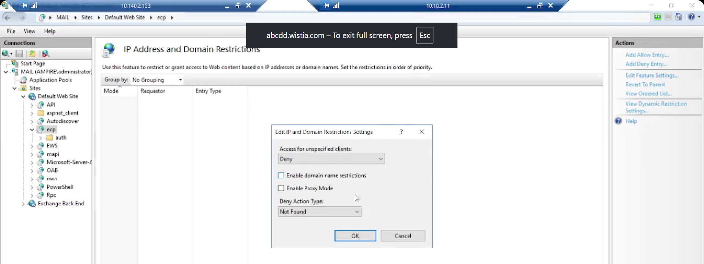{#fig:024 width=70%}

Следует отметить, что индикатор устранения уязвимости не изменится,
пока не будет устранено последствие в виде вредоносного
meterpreter-соединения.

Обнаружение и нейтрализация полезных нагрузок.
Meterpreter-сессия.
Данная полезная нагрузка заключается в получении нарушителем
meterpreter-сессии с уязвимым сервером.
Данную полезную нагрузку можно обнаружить с помощью утилиты
netstat с ключами -b -o. В случае установления соединения на уязвимой
машине появится сокет с машиной нарушителя (рис. [-@fig:025]).

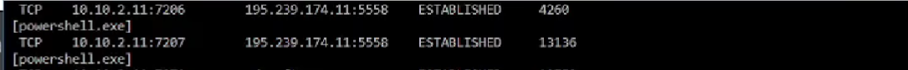{#fig:025 width=70%}

Для закрытия meterpreter-сессии необходимо завершить процесс
данного соединения с помощью команды taskkill /PID <PID> /F. Данная команда в системе Windows используется для
принудительного завершения процесса. На вход команда taskkill получает идентификатор процесса PID и параметр команды /F, который указывает на
принудительное завершение процесса (рис. [-@fig:026]).

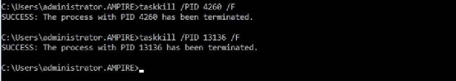{#fig:026 width=70%}

Web-shell China Chopper.
Backdoor «China Chopper» можно найти в очевидной для таких атак
директории С:/Program Files/Microsoft/Exchange
Server/V15/FrontEnd/HttpProxy/owa/auth/AM_backdoor.aspx.
Большинство POC (проверок концепций) эксплуатации уязвимости
Proxylogon записывают файл именно по данному адресу, что выполняется
для доступа backdoor без авторизации из веб-директории owa/auth. При
необходимости полезную нагрузку можно записать в другую директорию. В журнал «IIS» также попадает POST запрос к
указанному backdoor.
Для устранения полезной нагрузки необходимо:
- удалить файл веб-оболочки по пути С:/Program
Files/Microsoft/Exchange Server/V15/FrontEnd/HttpProxy/../auth/ (рис. [-@fig:027])

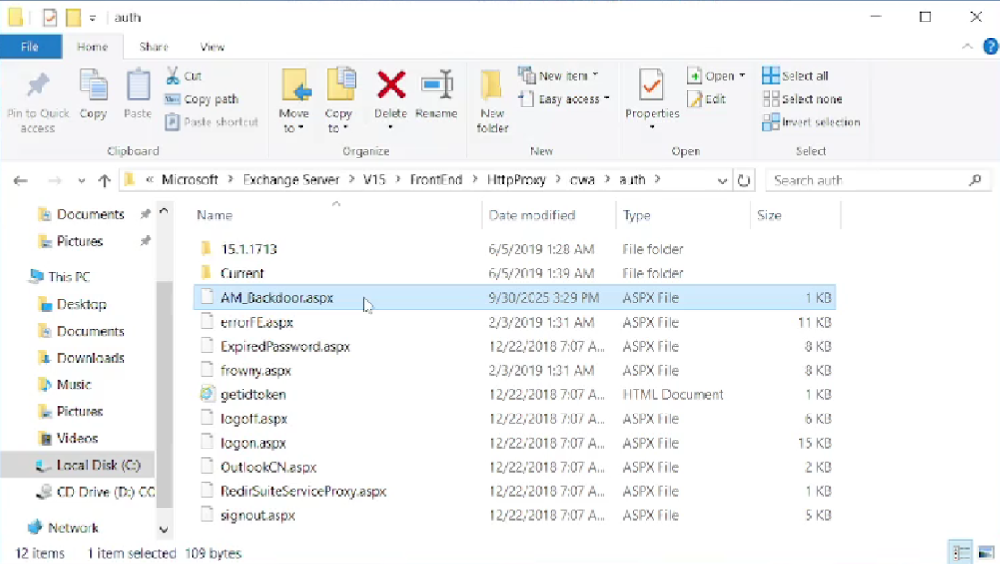{#fig:027 width=70%}

- завершить все соединения между уязвимой машиной и
нарушителем.

Уязвимость и последствия Proxylogon устранены (рис. [-@fig:028]).

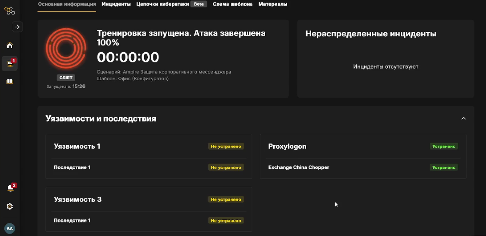{#fig:028 width=70%}

## Уязвимый узел RocketChat

CVE-2021-22911 представляет собой две уязвимости NoSQL
Injection, эксплуатация которых может позволить злоумышленникам
повысить свои привилегии, выполнить произвольные системные команды на
хост-сервере и украсть конфиденциальные пользовательские данные и
сообщения чата.
Первая уязвимость CVE-2021-22911: слепая NoSQL-инъекция,
позволяющая украсть токен сброса пароля пользователя. Эксплуатация этой
уязвимости работает следующим образом: злоумышленник запрашивает сброс
пароля для пользователя, используя его адрес электронной почты. Далее
использует уязвимость недостаточной проверки параметров запроса в методе
getPasswordPolicy (server/methods/getPasswordPolicy.js),
подставляет вместо токена-строки оператор БД regex c якорем ^, анализируя
ответ сервера подбирает токен сброса пароля (находит первый символ, затем
первые два и т.д.).
NoSQL-инъекция №2: повышение привилегий. Данная уязвимость
требует аутентификации, но имеет большее влияние: ее можно использовать
не только для утечки токена сброса пароля пользователя, но и любого поля
любого пользователя в базе данных. Конечная точка API users.list
(app/api/server/v1/users.js) принимает параметр запроса из URL-адреса,
который затем используется для запроса коллекции пользователей. Документы в этой коллекции содержат поля, которые не должны быть
доступны всем, поэтому запрос фильтруется sс помощью черного списка,
который удаляет определенные поля из запроса и результата. Чтобы обойти
фильтр, можно использовать оператор верхнего уровня where, который
берет выражение JavaScript и выполняет его для каждого документа в
коллекции, чтобы решить, должен ли документ содержаться в наборе
результатов или нет. Для вывода информации используется выброс
исключения с нужным полем: {"where":"this.username==='admin' &&
(()=>{ throw this.secret })()"}
Для достижения RCE злоумышленник может использовать встроенный в
Rocket Chat механизм «Интеграции», который позволяет создавать входящие
и исходящие webhook. Webhook могут иметь связанные с ними сценарии,
которые выполняются при их срабатывании.
На данном узле используется только вторая инъекция, так как подбор
токена занимает много времени (около 30 минут), получение
непривилегированной учетной записи осуществляется путем регистрации
нового аккаунта [@rocketchat].

### Обнаружение CVE-2021-22911 (NoSQL Injection)

Эксплуатация первой инъекции сопровождается большим количеством
запросов к серверу, так как идет подбор токена для смены пароля
непривилегированного пользователя. Данное событие можно обнаружить в
логах Rocket Chat из-за большого количества сообщений об ошибках в
методе getPasswordPolicy.

Первая деталь эксплуатации второй NoSQL-инъекции - это
невозможность осуществления входа на веб-интерфейс под учетными
данными администратора (логин: admin@rocket-local.com, пароль:
qwe123!@#). В syslog пишутся следующие строчки:
- ошибка отправки приветственного сообщения при регистрации
нового аккаунта;
- письмо для сброса пароля админа;
- ошибки при выполнении сценариев WebHook.

Также лог RocketChat доступен в веб-интерфейсе:
«Администрирование» - «Просмотр логов».
После восстановления пароля администратора в веб-интерфейсе
RocketChat во вкладке «Администрирование» - «Интеграции» можно увидеть
добавленные сценарии, зайдя в которые можно посмотреть
выполненные команды.

Непосредственно эксплуатацию уязвимости обнаружить при помощи
сетевого сенсора ViPNet IDS NS не получится, однако успешно
детектируются последствия, а именно скачивание вредоносного файла для
установки обратного TCP-соединения (meterpreter-сессии), и
непосредственно установка этого соединения на 4444 порту.

### Устранение CVE-2021-22911 (NoSQL Injection)

Закрытие уязвимостей в Rocket Chat.
Перейдем на удаленный рабочий стол.

Для восстановления доступа к аккаунту администратора необходимо
сбросить пароль (рис. [-@fig:029]). Письмо с инструкциями для сброса пароля
можно прочитать при помощи текстового редактора, прочитав файл
/var/mail/admin. Необходимо скопировать ссылку из письма, в данном примере (рис. [-@fig:030]).

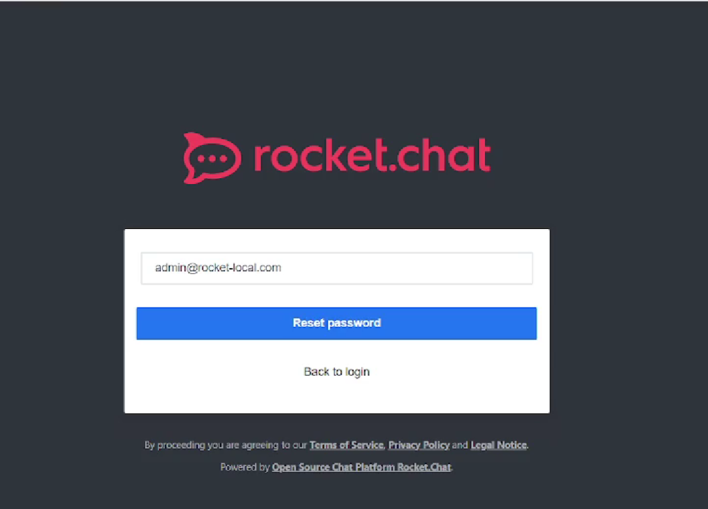{#fig:029 width=70%}

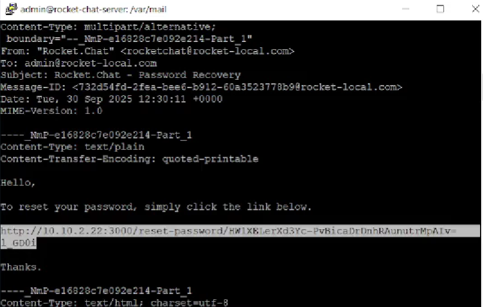{#fig:030 width=70%}

Нужно обратить внимание, что в терминале при переносе строки
используется знак «=», его следует игнорировать.
После этого необходимо ввести новый пароль. Для учетной записи
администратора Rocket Chat настроена двухфакторная аутентификация при
помощи TOTP (Time-based one-time password). Для генерации
одноразового пароля необходимо воспользоваться программой KeePass,
доступной на машине администрирования. В контекстном меню выбрать «KeeOtp2» - «Show TOTP» (рис. [-@fig:031]-[-@fig:032]).

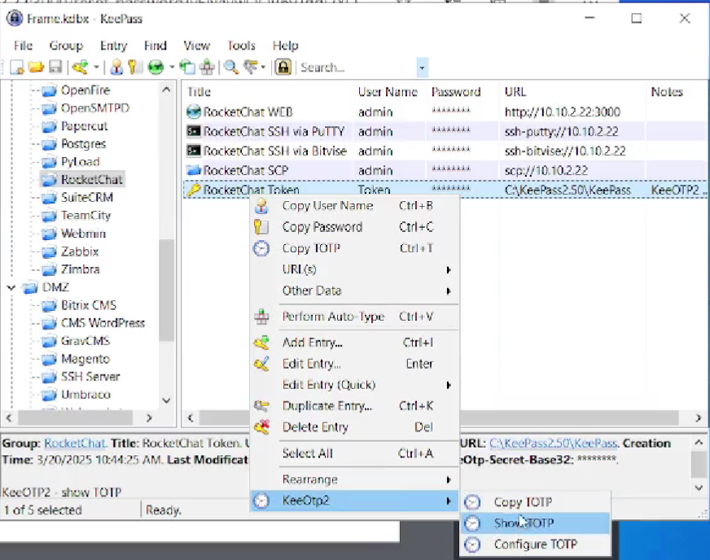{#fig:031 width=70%}

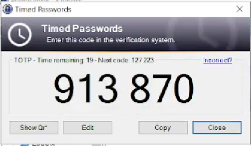{#fig:032 width=70%}

Если при введении токена всплывает ошибка, то игнорируя ее,
необходимо осуществить вход под новым паролем (рис. [-@fig:033]).

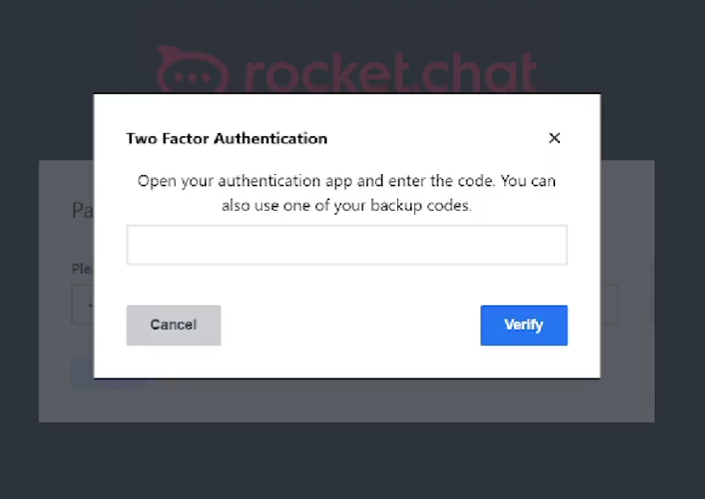{#fig:033 width=70%}

Закрытие без обновления.
Так как вторая NoSQL-инъекция для повышения привилегий использует
высокоуровневый оператор БД where, временной, смягчающей мерой, может
стать отключение выполнения JavaScript на стороне сервера базы данных.
Для этого необходимо отредактировать файл конфигурации БД
/etc/mongod.conf, добавив строчку javascriptEnabled: false (рис. [-@fig:034]).

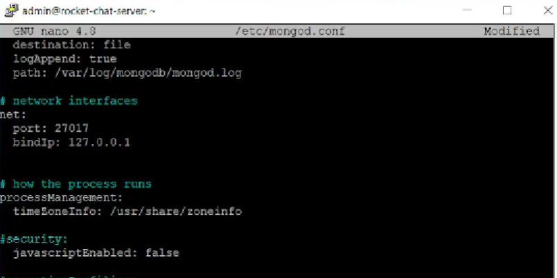{#fig:034 width=70%}

### Обнаружение и нейтрализация полезных нагрузок

Meterpreter-сессия. Цель данной полезной нагрузки - получение нарушителем shell-сессии
с уязвимым сервером.
Данную полезную нагрузку можно обнаружить при выводе сетевой
статистики с помощью утилиты ss и параметрами –tp (позволяет
просматривать сведения по TCP-соединениям, список процессов в данный
момент). В случае установления соединения, на уязвимой машине появится
сокет с машиной нарушителя.
Нейтрализовать meterpreter-сессию также можно при помощи
утилиты ss с ключом –K, чтобы завершить все сессии с машиной нарушителя
необходимо ввести: sudo ss –K dst HACKER_IP dport = HACKER_PORT (рис. [-@fig:035]).

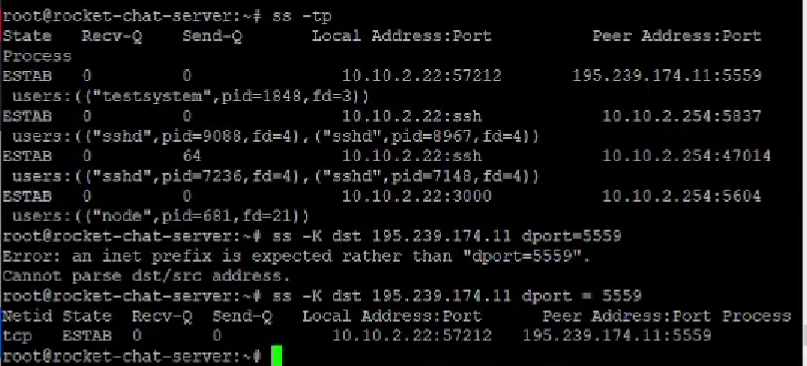{#fig:035 width=70%}

Уязвимость и последствия RocketChat устранены (рис. [-@fig:036]).

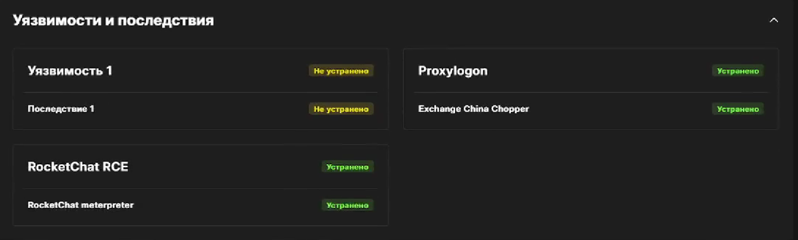{#fig:036 width=70%}

## Карточки индидентов

Карточка инцидента WP Disckuz RCE (рис. [-@fig:037]).

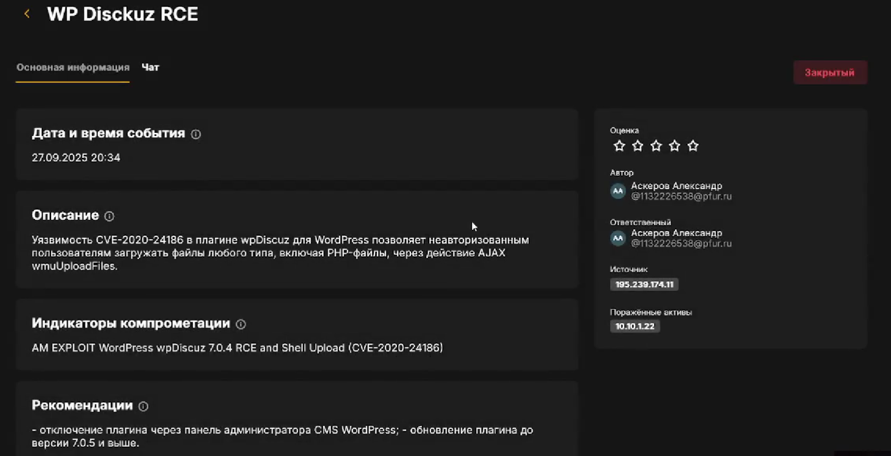{#fig:037 width=70%}

Карточка инцидента Proxylogon (рис. [-@fig:038]).

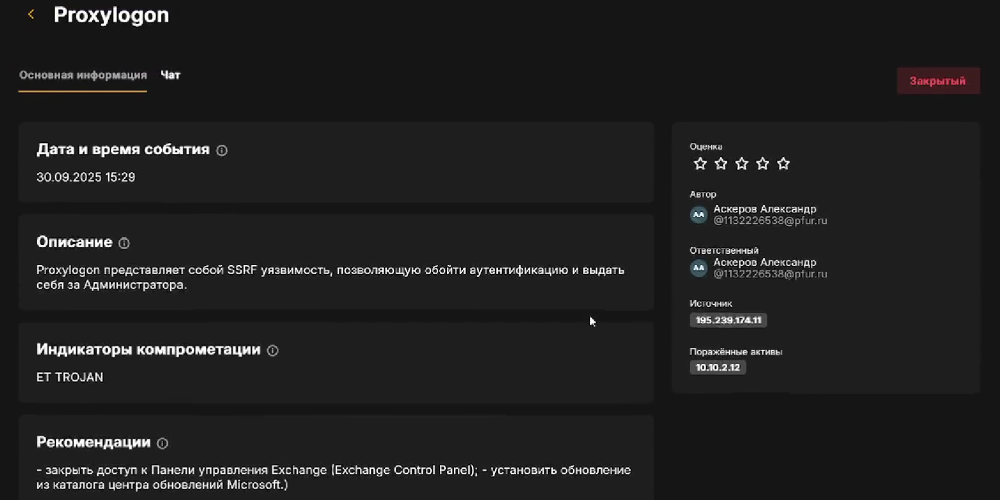{#fig:038 width=70%}

Карточка инцидента Rocketchat RCE (рис. [-@fig:039]).

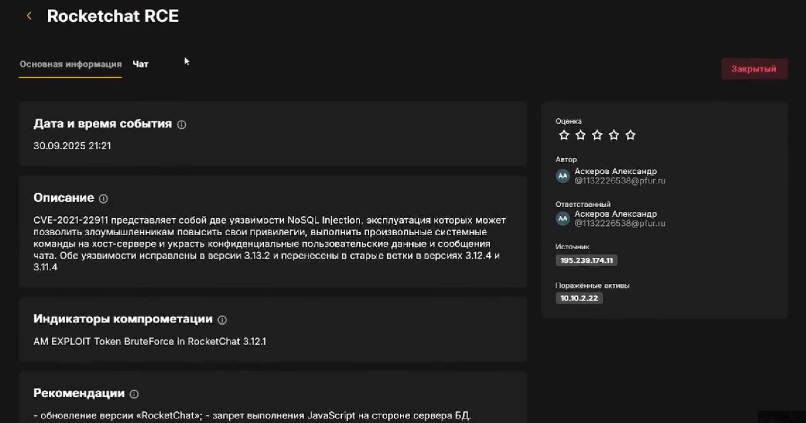{#fig:039 width=70%}

# Вывод

В ходе выполнения данной лабораторной работы мы исследовали сценарии целенаправленной атаки на корпоративный мессенджер и сопутствующие сервисы, выявили и продемонстрировали эксплуатацию реальных уязвимостей (WpDiscuz, ProxyLogon, RocketChat), а также отработали методы обнаружения, локализации и нейтрализации последствий компрометации для восстановления безопасности информационной инфраструктуры организации.

# Список литературы{.unnumbered}

::: {#refs}
:::

