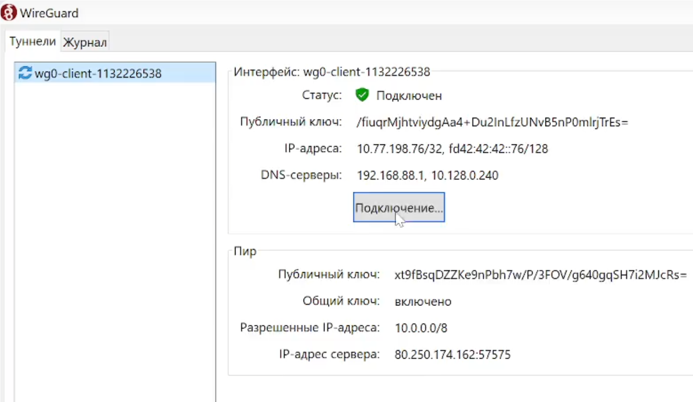
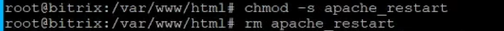
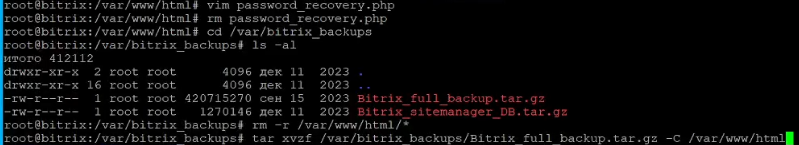
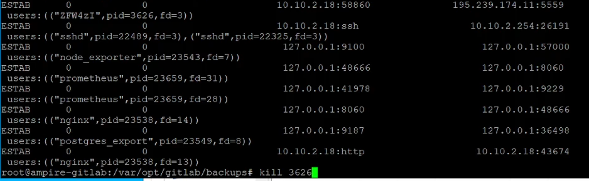
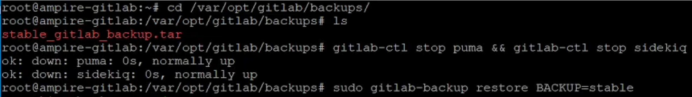
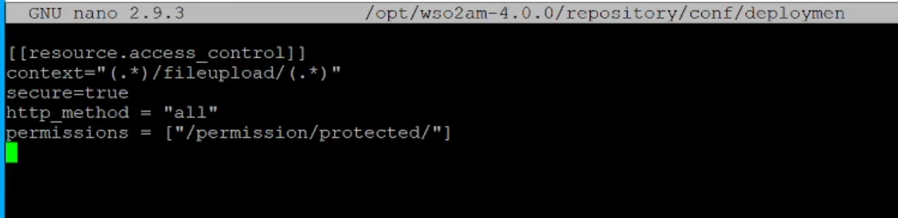
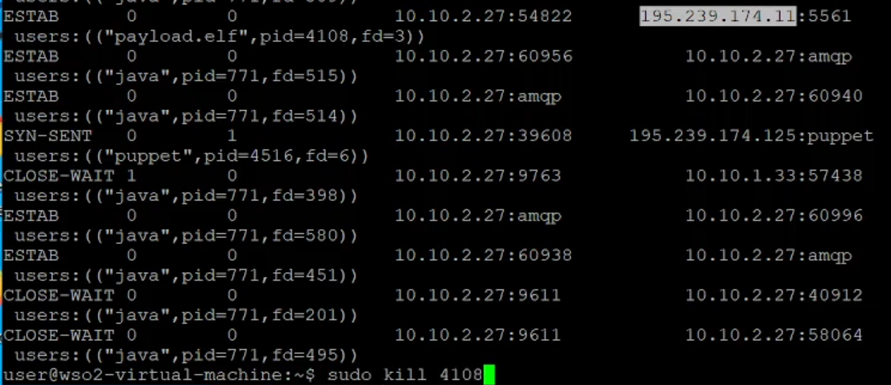

---
## Front matter
title: "Лабораторная работа №2"
subtitle: "Кибербезопасность предприятия"
author: |
    | Аскеров Александр Эдуардович
    | Замбалова Дина Владимировна
    | Кузнецова София Вадимовна
    | Поляков Глеб Сергеевич
    | Скандарова Полина Юрьевна
    | Тарутина Кристина Еленовна
    | Цвелев Сергей Андреевич
    | Шулуужук Айраана Вячеславовна
    | Учебная группа: НПИбд-01-22

## Generic otions
lang: ru-RU
toc-title: "Содержание"

## Bibliography
bibliography: bib/cite.bib
csl: pandoc/csl/gost-r-7-0-5-2008-numeric.csl

## Pdf output format
toc: true # Table of contents
toc-depth: 2
lof: true # List of figures
fontsize: 12pt
linestretch: 1.5
papersize: a4
documentclass: scrreprt
## I18n polyglossia
polyglossia-lang:
  name: russian
  options:
	- spelling=modern
	- babelshorthands=true
polyglossia-otherlangs:
  name: english
## I18n babel
babel-lang: russian
babel-otherlangs: english
## Fonts
mainfont: PT Serif
romanfont: PT Serif
sansfont: PT Sans
monofont: PT Mono
mainfontoptions: Ligatures=TeX
romanfontoptions: Ligatures=TeX
sansfontoptions: Ligatures=TeX,Scale=MatchLowercase
monofontoptions: Scale=MatchLowercase,Scale=0.9
## Biblatex
biblatex: true
biblio-style: "gost-numeric"
biblatexoptions:
  - parentracker=true
  - backend=biber
  - hyperref=auto
  - language=auto
  - autolang=other*
  - citestyle=gost-numeric
## Pandoc-crossref LaTeX customization
figureTitle: "Рис."
tableTitle: "Таблица"
listingTitle: "Листинг"
lofTitle: "Список иллюстраций"
lolTitle: "Листинги"
## Misc options
indent: true
header-includes:
  - \usepackage{indentfirst}
  - \usepackage{float} # keep figures where there are in the text
  - \floatplacement{figure}{H} # keep figures where there are in the text
---

# Цель работы

Целью лабораторной работы является исследование сценария целевой атаки на инфраструктуру компании, включая эксплуатацию уязвимостей в веб-сервисе Bitrix, сервере GitLab и платформе управления API WSO2. Задачи работы включают обнаружение, анализ и нейтрализацию последствий атаки, а также восстановление работоспособности и безопасности компрометированных систем.

# Теоретическое введение

## Легенда. Защита интеграционной платформы

Конкуренты решили нанести репутационный вред деятельности компании и для этого нашли исполнителя. Злоумышленник находит в Интернете сайт соответствующей организации и решает провести атаку на него с целью получения доступа к внутренним ресурсам.

Проэксплуатировав обнаруженную на сайте уязвимость, нарушитель наносит ущерб работе и репутации владельца сайта, блокирует доступ к нему и стремится захватить управление над другими ресурсами защищаемой сети. В ходе вектора атаки злоумышленник, используя уязвимость при загрузке определенных файлов в репозиторий, закрепился на узле GitLab и продолжил своё перемещение внутри периметра. Далее злоумышленник успешно подключается к платформе, предназначенной для создания и управления API, с целью получения доступа к внутренним данным компании, раскрытие которых может привести к серьезным репутационным и финансовым потерям.

Квалификация нарушителя высокая. Он умеет использовать инструментарий для проведения атак, а также знает техники постэксплуатации.

## Описание уязвимостей

### CVE-2022-27228 (1C-Битрикс)

Уязвимость в модуле «vote» системы управления содержимым сайтов (CMS) «1C-Битрикс: Управление сайтом» позволяет нарушителю удаленно записывать произвольные файлы в систему и выполнять произвольный код, используя небезопасную десериализацию. Уязвимость присутствует в версиях Bitrix до 22.0.400.

### CVE-2021-22204/GitLab (CVE-2021-22205)

Критическая уязвимость в GitLab CE/EE, затрагивающая все версии начиная с 11.9. Уязвимость заключается в неправильной проверке файлов изображений, передаваемых в парсер ExifTool, что приводит к удаленному выполнению команд (RCE) при загрузке специально сформированного файла.

### CVE-2022-29464 (WSO2 API Manager)

Уязвимость платформы для интеграции интерфейсов прикладного программирования, приложений и веб-служб WSO2 связана с возможностью загрузки произвольного JSP-файла на сервер без надлежащей аутентификации. Эксплуатация уязвимости позволяет удаленно выполнить произвольный код.

# Выполнение лабораторной работы

Подключили vpn WireGuard, чтобы открыть сайт Ampire с лабораторной работой.

{#fig:001 width=70%}

## Уязвимый узел Bitrix (CVE-2022-27228)

### Обнаружение уязвимости

Эксплуатация уязвимости CVE-2022-27228 была обнаружена по наличию в лог-файле `/var/log/apache2/access.log` записей с обращением к файлу `/bitrix/tools/vote/uf.php` и внедрением полезной нагрузки.

Были обнаружены артефакты атаки:
1.  POST-запросы к `uf.php` с передачей вредоносного PHAR-файла (`payload2.phar`).
2.  Файл веб-шелла `/var/www/html/caidao.php`, загруженный в результате выполнения уязвимости.
3.  Наличие в директории `/var/www/html/` файлов `apache_restart` (с SUID-битом) и `systemctl`, используемых для повышения привилегий и поддержания доступа.

Сетевой сенсор ViPNet IDS NS зафиксировал события, связанные с эксплуатацией уязвимости:
-   `AM EXPLOIT Possible Bitrix CMS below v21.0.100 RCE in module vote (CVE-2022-27228)`
-   `ET EXPLOIT php script base64 encoded Remote Code Execution 2`
-   `ET POLICY Executable and linking format (ELF) file download`

### Устранение уязвимости и последствий

1.  **Закрытие вектора LPE (Local Privilege Escalation):**
    -   Удален SUID-бит у файла `/var/www/html/apache_restart` командой `chmod -s apache_restart`, после чего файл был удален.
    -   Удален файл `/var/www/html/upload/systemctl`.

{#fig:002 width=70%}

2.  **Закрытие уязвимости CVE-2022-27228:**
    -   В файл `/var/www/html/bitrix/tools/vote/.htaccess` добавлена директива `deny from all`, блокирующая все запросы к уязвимому модулю.

{#fig:003 width=70%}

3.  **Нейтрализация последствий:**
    -   Завершены вредоносные meterpreter-сессии с помощью команды `kill -9 <PID>` для процессов, установивших соединение с IP-адресом злоумышленника.
    -   Удален веб-шелл `caidao.php`.
    -   Для восстановления доступа к панели администратора использован скрипт `password_recovery.php`, который сбросил пароль учетной записи администратора. После входа скрипт был удален.
    -   Веб-сайт восстановлен из резервной копии `Bitrix_full_backup.tar.gz`, расположенной в `/var/bitrix_backups/`.

{#fig:004 width=70%}

## Уязвимый узел GitLab (CVE-2021-22204)

### Обнаружение уязвимости

Эксплуатация уязвимости была обнаружена по записям в логах GitLab (`/var/log/gitlab/gitlab-rails/production_json.log`), указывающим на загрузку файла с расширением `.jpg`, который содержал вредоносную нагрузку для RCE.

Сетевой сенсор ViPNet IDS NS зафиксировал событие: `AM EXPLOIT GitLab CE/EE 11.9-13.10.3 Unauthenticated Remote ExifTool Command Injection (CVE-2021-22205)`.

Были обнаружены последствия атаки:
-   Наличие на сервере подозрительных пользовательских аккаунтов, созданных злоумышленником.
-   Факт создания и выгрузки резервной копии базы данных (`evil_*_gitlab_backup.tar`).

### Устранение уязвимости и последствий

1.  **Обновление GitLab:**
    -   GitLab был обновлен до версии 13.10.3 с помощью пакета `gitlab-ce_13.10.3-ce.0_amd64.deb` командой `sudo dpkg -i`.

2.  **Изменение политики безопасности:**
    -   В панели администратора GitLab в разделе `Settings -> General -> Sign-up restrictions` активирована опция, требующая подтверждения регистрации новых пользователей администратором.
    -   Удалены все учетные записи, созданные злоумышленником.

{#fig:005 width=70%}


3.  **Нейтрализация последствий:**
    -   Удалена оставленная нарушителем резервная копия базы данных (`evil_*_gitlab_backup.tar`).
    -   Завершены вредоносные соединения (meterpreter-сессии) с помощью команды `kill -9 <PID>`.

{#fig:006 width=70%}

## Уязвимый узел WSO2 API Manager (CVE-2022-29464)

### Обнаружение уязвимости

Эксплуатация уязвимости была обнаружена по записям в логах доступа (`/var/log/wso2_http_access.log`), указывающим на загрузку файла `exploit.jsp` на уязвимый маршрут `fileupload`.

На сервере были обнаружены артефакты:
-   Файл `exploit.jsp` по пути `/opt/wso2am-4.0.0/repository/deployment/server/webapps/authenticationendpoint/`.
-   Сгенерированный файл `payload.elf` в директории `/tmp`.
-   Активные meterpreter-сессии, установленные через выполнение `payload.elf`.

### Устранение уязвимости и последствий

1.  **Изменение конфигурации:**
    -   В конфигурационный файл `/opt/wso2am-4.0.0/repository/conf/deployment.toml` добавлены правила контроля доступа для маршрута `fileupload`, требующие аутентификации и соответствующих разрешений:
        ```toml
        [[resource.access_control]]
        context="(.*)/fileupload/(.*)"
        secure=true
        http_method = "all"
        permissions = ["/permission/protected/"]
        ```
    -   Служба WSO2 перезапущена: `systemctl restart wso2api.service`.

{#fig:007 width=70%}

2.  **Нейтрализация последствий:**
    -   Удалены файлы, загруженные в ходе атаки: `exploit.jsp` и `payload.elf`.
    -   Завершены вредоносные meterpreter-сессии с помощью команды `kill -9 <PID>`.

{#fig:008 width=70%}

# Вывод

В ходе выполнения лабораторной работы была успешно исследована многоэтапная целевая атака на корпоративную инфраструктуру. Были отработаны практические навыки по обнаружению, анализу и нейтрализации последствий эксплуатации критических уязвимостей в популярном веб-фреймворке (1C-Битрикс), системе контроля версий (GitLab) и платформе управления API (WSO2). В результате проведенных мероприятий безопасность всех компрометированных систем была восстановлена: уязвимости закрыты, последствия атаки устранены, работоспособность сервисов восстановлена из резервных копий. Работа продемонстрировала важность комплексного подхода к безопасности, включающего своевременное обновление ПО, мониторинг событий безопасности и наличие актуальных резервных копий.

# Список литературы{.unnumbered}

::: {#refs}
:::
```
